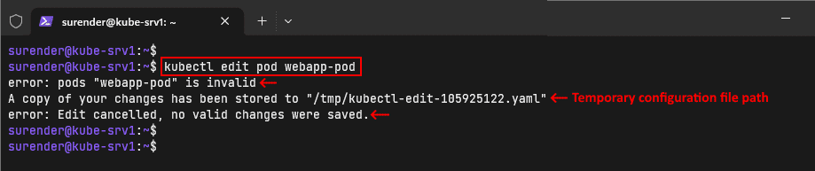

## Pods

To run your containerized application in a Kubernetes cluster, you need to run a Pod because, unlike Docker, Kubernetes doesn't run containers directly

## Create a Pod using the imperative approach

```sh
kubectl run webapp-pod --image=nginx
```
This command creates a new Pod named webapp-pod in the default namespace using the nginx image from the Docker Hub public registry.

To create the Pod in a different namespace, you can specify it with the --namespace (or -n) parameter (e.g., --namespace=dev). A namespace is a way of isolating a group of resources in a Kubernetes cluster. Furthermore, while creating a Pod, you can also add labels using the --labels parameter (e.g., --labels="app=webapp,tier=front-end"), which helps you identify the relevant Pods when you have a lot of them running in the cluster

## View a Pod

```sh
kubectl get pods
```
Will list the pods in default namespace, if need to list the pods from a specific namespace add the attribute -n <namespace name>

## Inspect a Pod

```sh
kubectl describe pod <pod name>
```

## Delete a Pod

```sh
kubectl delete pod <pod name>
```

## Create a YAML config file

Writing configuration files can be hard, particularly for beginners. Fortunately, there is a quick and easy way to generate configuration files in Kubernetes. To do so, we will use the imperative command that we used in the previous section and tweak it a little bit, as shown below

```sh
kubectl run webapp-pod --image=nginx --dry-run=client --output=yaml
```

- Dry run will not create the object
- output flag will give output in yaml format


## Create the Pod with a YAML file

With the yaml file we got from the above command, use the below command

```sh
kubectl apply -f <file name>.yaml
```

## Modify a running Pod

Once the pods are created  , it connot be modified most of the contents are immutable in the pod content, pod spec can be modified, for modifying the pod use the command

```sh
kubectl edit pod <pod name>
```

Lets say you are trying to change the parameters which cannot be modified, it will store the changes to the temp file and will not make any changes to the actual running pod



So there are two ways for creating the pod here
- One by deleting the pod manually and recreating the pod with the yaml
- By using the replace command with force flag 

```sh
kubectl replace -f <file name.yaml>  --force
```
